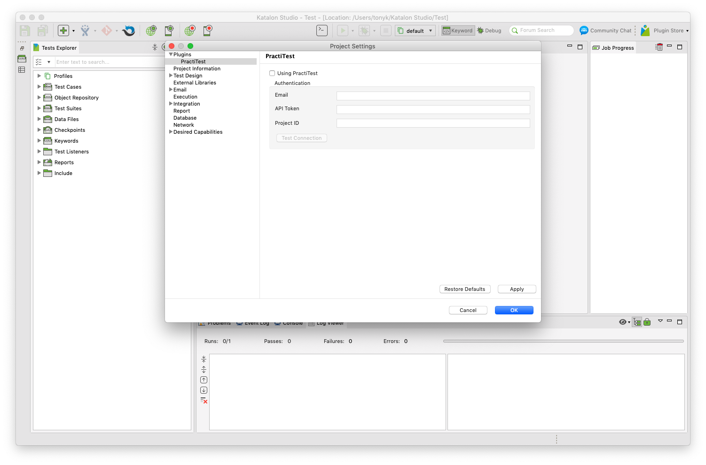

# PractiTest for Katalon Studio

WIP PractiTest integration for Katalon Studio.

## Setup

After installation, go to Project -> Settings -> Plugins -> PractiTest. Click "Using PractiTest" and enter the authentication details.

- **Email**: Developer email
- **API Token**: PractiTest API token
- **Project ID**: PractiTest project ID

## Test Case

Once a connection to PractiTest is established in the plugin configuration, you can now connect test cases to PractiTest.

Go to a test in Katalon Studio and click the "Integration" tab. In the integration tab, there is a new menu "PractiTest". Here you will enter the test ID from PractiTest to link the tests together. This effectively allows you to "implement" PractiTest tests inside Katalon Studio.

Linking test cases in Katalon Studio to tests in PractiTest allows for test instances to post results back up to PractiTest when run in a test suite. 